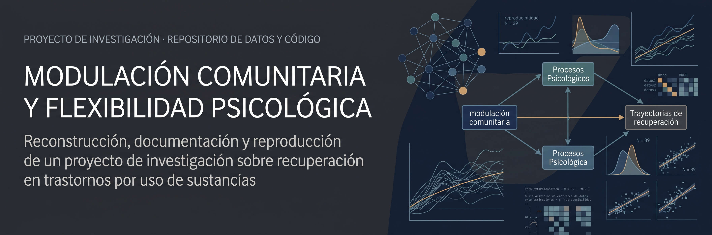
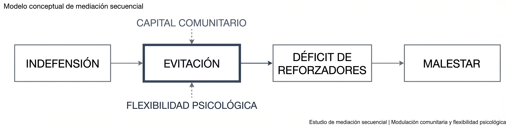
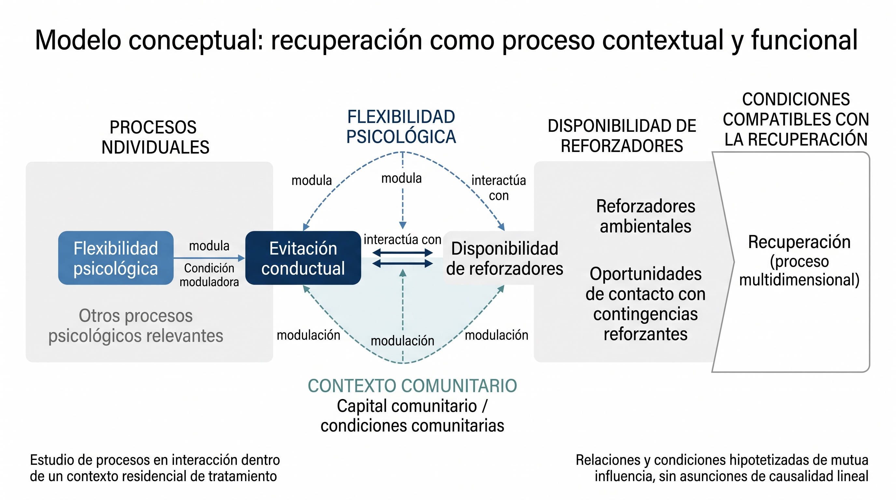

# Modulación comunitaria y flexibilidad psicológica

**Estudio de mediación secuencial en población residencial con trastornos por consumo de sustancias**

  

> **ESTUDIO EN PROCESO · Resultados y materiales en revisión**

## Resumen

La recuperación de los trastornos por consumo de sustancias ocurre en interacción con procesos psicológicos individuales y con las condiciones sociales y comunitarias en las que se desarrolla el tratamiento. En este contexto, la **rumiación** y los **pensamientos automáticos negativos** pueden constituir procesos relevantes de malestar y evitación, mientras que la flexibilidad psicológica y las características del entorno comunitario podrían modificar la forma en que estos procesos se relacionan con la recuperación.

## Modelo de mediación

Este proyecto examina un modelo de **mediación secuencial** en población residencial.

  

El modelo explora el papel modulador del **capital comunitario** y la **flexibilidad psicológica**.

## Objetivo

Evaluar un modelo de mediación secuencial de procesos relacionados con la recuperación en una comunidad terapéutica residencial, así como explorar si el contexto comunitario y la flexibilidad psicológica modifican las relaciones entre evitación, reforzadores ambientales y malestar.

## Método

El estudio incluyó **24 participantes** en tratamiento residencial.

Se utilizaron medidas de:

### Variables y procesos estudiados

| Procesos psicológicos | Contexto y recuperación |
|---|---|
| **Indefensión** | **Capital comunitario** |
| **Evitación conductual (BADS)** | **Flexibilidad psicológica** |
| **Pensamientos automáticos negativos (ATQ-8)** | **Reforzadores ambientales (EROS)** |
| **Rumiación** | **Malestar psicológico** |

Se realizaron análisis de mediación y moderación mediante procedimientos de **bootstrapping**, complementados con la construcción de proxies analíticos para capital comunitario y flexibilidad psicológica.

El repositorio documenta la metodología, la procedencia de los análisis, los materiales de difusión y, conforme avance la revisión, los resultados agregados que puedan hacerse públicos.

## Resultados reportados

Los análisis del proyecto reportaron evidencia compatible con una **mediación secuencial** de los procesos de indefensión, evitación, déficit de reforzadores y malestar.

Entre los resultados documentados se encuentran:

* un efecto indirecto secuencial total de **β = 2.735, p < .001**;
* una interacción entre capital comunitario y evitación en la predicción de reforzadores ambientales (**β = 0.195, p = .026**);
* una asociación directa entre flexibilidad psicológica y reforzadores ambientales (**β = −3.559, p = .022**).

De manera complementaria, el protocolo breve de desmantelamiento de rumiación mostró cambios en indicadores de depresión y progreso valoral, con patrones diferenciados según la carga de pensamientos automáticos negativos.

Estos resultados se presentan aquí como parte del **estado actual del proyecto** y permanecen sujetos a revisión metodológica, documental y de procedencia.

## Interpretación conceptual

## Modelo conceptual

El modelo parte de una perspectiva contextual y funcional de la recuperación.

...

  

*Figura 1. Modelo conceptual del proyecto. La figura representa relaciones hipotetizadas y no constituye un modelo causal definitivo.*

El modelo parte de una perspectiva contextual y funcional de la recuperación.

**Contexto comunitario + flexibilidad psicológica** pueden modificar la relación entre los procesos de evitación y la disponibilidad de reforzadores. A su vez, la reducción de patrones de evitación y el incremento de repertorios psicológicamente flexibles podrían favorecer condiciones más compatibles con la recuperación.

El proyecto no pretende reducir la recuperación a un único mecanismo psicológico. El interés se centra en estudiar cómo **procesos individuales y condiciones comunitarias interactúan dentro de un contexto residencial de tratamiento**.

## Estado del proyecto

**Estado:** estudio en proceso.

El repositorio se encuentra en construcción y está organizado como un espacio de documentación científica reproducible y progresiva. Su propósito es reunir los materiales que permiten comprender **cómo se plantea, documenta y comunica el estudio**, manteniendo separadas las fuentes clínicas individuales de los materiales destinados a consulta pública.

### Contenido del repositorio

El repositorio incorpora, de manera progresiva:

* **Metodología y documentación:** descripción del diseño, decisiones analíticas, procedencia y limitaciones.
* **Resultados agregados:** resultados estadísticos que pueden compartirse sin exponer información individual.
* **Figuras y visualizaciones:** materiales gráficos y código utilizado para su generación.
* **Referencias y difusión científica:** bibliografía, materiales de presentación y documentación asociada a la comunicación del proyecto.

### Protección de la información

Los materiales clínicos individuales y cualquier información potencialmente identificable **permanecen fuera del repositorio público**. Esto incluye bases de datos a nivel participante, narrativas clínicas, transcripciones, archivos derivados que permitan reconstruir información individual y cualquier documento que contenga identificadores o rutas internas de trabajo.

La publicación se limita a materiales preparados específicamente para su difusión científica y compatibles con los principios de **protección de datos, trazabilidad y transparencia metodológica**.

## Protección de datos

Este repositorio **no contiene ni contendrá datos individuales de participantes**. La publicación se limita a materiales preparados específicamente para difusión científica pública y a resultados agregados que no permitan identificar información individual.

| Material no publicado                                         | Motivo de exclusión                                                                                       |
| ------------------------------------------------------------- | --------------------------------------------------------------------------------------------------------- |
| Bases de datos clínicas y filas individuales                  | Contienen información a nivel participante y no son necesarias para la documentación pública del estudio. |
| Identificadores, números de expediente y fechas individuales  | Pueden contribuir a la identificación directa o indirecta de participantes.                               |
| Narraciones clínicas y transcripciones                        | Pueden contener información sensible o elementos identificables presentes en el texto original.           |
| Corpus de texto y embeddings derivados                        | Pueden conservar o permitir inferir información derivada de material clínico no público.                  |
| Checkpoints que contienen datos                               | Pueden incorporar datos individuales o representaciones derivadas de estos.                               |
| Credenciales, tokens y claves de acceso                       | Son información de seguridad y nunca forman parte de una publicación científica.                          |
| Manifiestos con rutas o nombres de archivos clínicos internos | Pueden revelar información sobre la organización y localización de materiales clínicos no públicos.       |

Los resultados que se incorporen al repositorio serán exclusivamente **agregados y apropiados para difusión científica pública**.

## Estructura

El repositorio organiza los materiales públicos del proyecto en tres funciones principales: documentar, analizar y comunicar. Esta separación permite distinguir entre la documentación científica, los materiales asociados al análisis y los recursos destinados a la difusión.

                         PROYECTO
                            │
          ┌─────────────────┼─────────────────┐
          │                 │                 │
          ▼                 ▼                 ▼
     DOCUMENTAR          ANALIZAR         COMUNICAR
          │                 │                 │
        docs/        tablas/ · figuras/   difusion/
                          │
                       codigo/
                          │
                       assets/
                   soporte visual

Documentar reúne la metodología, procedencia, limitaciones y decisiones analíticas.
Analizar concentra los resultados agregados, las figuras y el código asociado a su generación.
Comunicar contiene los materiales preparados para la difusión científica del proyecto.

Los materiales clínicos individuales y cualquier información potencialmente identificable permanecen fuera del repositorio público.

## Difusión científica

El proyecto forma parte de la producción científica presentada en espacios académicos relacionados con psicología clínica, ciencias contextuales y recuperación de adicciones.

Entre los materiales previstos se encuentran:

* **XI Reunión Nacional de Investigación en Psicología**
* **Presentación ACBS Chapter México — 10 de octubre**

Los materiales de difusión se incorporarán conforme sean revisados y estén disponibles para publicación. La información pública de las actividades puede consultarse en las páginas institucionales correspondientes: [ACBS Chapter México Sur](https://www.facebook.com/ChapterMexicoSurACBS) y [Sociedad Mexicana de Investigación y Psicología](https://www.facebook.com/smipoficial).

## Palabras clave

**Rumiación · Capital comunitario · Flexibilidad psicológica · Evitación experiencial · Comunidad terapéutica · Recuperación de adicciones · Mediación secuencial · Psicología contextual**

## Nota sobre el estado de los resultados

Este repositorio representa un **proyecto científico en proceso**. Las cifras y resultados incorporados en la documentación deben interpretarse dentro del diseño, tamaño muestral, características de la población y limitaciones analíticas correspondientes.

La documentación de metodología, procedencia y limitaciones se mantendrá separada de los materiales de difusión para facilitar una lectura transparente del desarrollo del proyecto.

---

**Proyecto:** *Modulación comunitaria y flexibilidad psicológica en la recuperación de adicciones: un estudio de mediación secuencial*

**Población:** adultos en tratamiento residencial por trastornos relacionados con el consumo de sustancias

**Contexto:** comunidad terapéutica residencial, México
**Institución participante:** Comunidad Terapéutica Under The Tree
**Estado:** estudio en proceso

