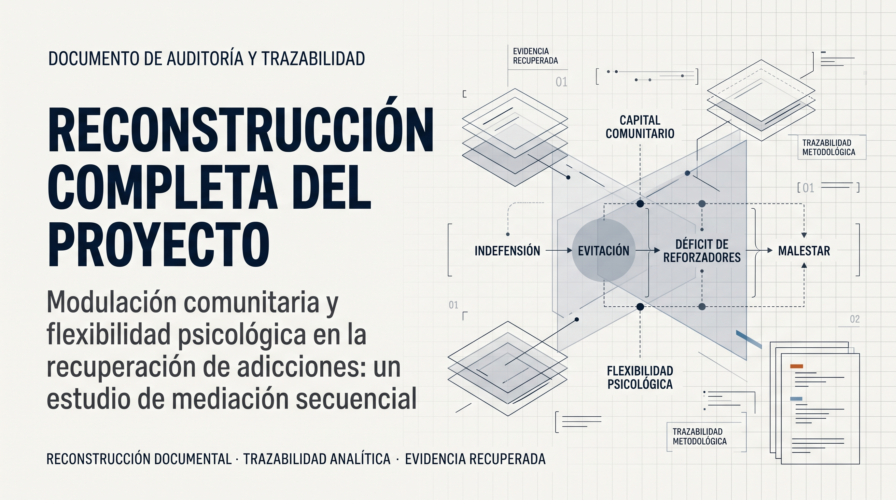

# RECONSTRUCCIÓN COMPLETA DEL PROYECTO

<p align="center">
  
</p>

**Documento central.** Reconstruye el proyecto «Modulación comunitaria y flexibilidad psicológica en la recuperación de adicciones: un estudio de mediación secuencial».

Cada apartado distingue entre información procedente de **fuentes documentales recuperadas** (N1–N4) y elementos de **reconstrucción analítica o documental** (N5).

**Revisión 2 — 21 de septiembre de 2026.** Esta revisión incorpora la localización y verificación de resultados primarios previamente no identificados. La interpretación de la primera revisión, según la cual determinados coeficientes no habían sido localizados, queda rectificada a partir de la nueva evidencia documental.

Este documento presenta una **reconstrucción documental y analítica del proyecto**. No constituye una publicación de datos individuales ni reproduce materiales clínicos, identificadores o información potencialmente identificable.

---

## 1. Origen de la idea

El proyecto **no nació como estudio independiente**: nació del cruce de tres líneas preexistentes, cada una
documentada por separado, más un bloque analítico de comunidad.

* **Línea A — Rumiación.** Estudio piloto controlado de desmantelamiento de rumiación en comunidad terapéutica
  masculina. Antecedente `rumia\Desmantelamiento de Rumia.pdf` (2022); instrumentos descargados en junio de
  2025; manuales de sesión (`Rumia sesion 1/2/3.tex`, dic. 2025–mar. 2026). `[N1/N3]`
* **Línea B — Corpus narrativo semanal.** Narraciones de residentes recolectadas durante 2025–2026,
  procesadas por el pipeline NLP `MFCA-N1` del Cap. 11 (`Tolerancia al malestar_Adicciones\Casi unico P.G.G\`).
  Es la fuente de las variables de proceso (indefensión, flexibilidad, capital comunitario). `[N1]`
* **Línea C — Dimensión comunitaria y DICO.** Diccionarios y features `dico_*` definidos en
  `SISAP-TUS-Research\sisap_tus\nlp\dico.py` y auditados en `migration\03d_procedencia_features_leakage.md`;
  marco formal en `DICO_Model\`. `[N1/N3]`
* **Punto de convergencia:** el bloque «ANÁLISIS DE MEDIACIÓN EN DOS PASOS: INDEFENSIÓN → EVITACIÓN → EROS →
  ATQ-8» de `MFCA_Autoencodere.R` (línea 7893) y los bloques de moderación con proxies (líneas ~8250–8390).
  Ahí, y sólo ahí, las tres líneas se integran. `[N1]`

**Cuándo:** las salidas del bloque están fechadas **2026-08-17 22:21**; el script se modificó el
**2026-08-18 01:16**; el resumen es del **2026-08-12 12:17**. Hay una corrida del pipeline registrada a las
**12:10:45 del 12 de agosto**. `NO DETERMINADO` el orden exacto (ver D-04).

## 2. Pregunta inicial

**Enunciada en el resumen** `[N2]`: «se desconoce cómo el contexto comunitario y la flexibilidad psicológica
modulan estos procesos [rumiación y ATQ-8]».
**Objetivo:** «Evaluar la mediación secuencial (indefensión → evitación → déficit de reforzadores → malestar)
y el rol modulador del capital comunitario y flexibilidad en población residencial».

**No se localizó** protocolo, pregunta de investigación previa ni pre-registro. Se conserva el enunciado del
resumen como formulación operativa. `[N2]`

## 3. Hipótesis

| # | Hipótesis | Evidencia | ¿Probada? |
|---|---|---|---|
| H1 | indefensión → evitación → déficit de reforzadores → malestar se encadena secuencialmente | Resumen + `mediacion_dos_pasos_bootstrap.txt` | **Sí**: `indirect1 = 2.735`, p < .001 |
| H2 | El capital comunitario modera la relación evitación–EROS | Resumen + `moderacion_capital_proxy_C.txt` | **Sí con el proxy C** (`evit_cap = 0.195`, p = .026); **no** con `dico_capital_compuesto` (0.045, p = .154) |
| H3 | La flexibilidad psicológica protege contra el déficit de reforzadores | Resumen + `moderacion_flexibilidad_proxy_F.txt` | **Sí**: `flex_c = −3.559`, p = .022 (efecto principal, no interacción) |
| H4 | El protocolo breve de desmantelamiento de rumiación mejora depresión y progreso valoral, más en pacientes con baja carga de ATQ-8 | Resumen + `Resultados analisis estadistico.tex` | **Sí, en la línea del estudio piloto** (reproducido) |

## 4. Muestra

| Fuente | N | Unidad | Composición |
|---|---|---|---|
| Resumen histórico | 24 | «participantes» | «en tratamiento residencial» |
| **Análisis real del modelo** | **425** | **observaciones persona-semana** | **39 participantes** (`modelo_EROS_ATQ.txt`: «Number of obs: 425, groups: ID, 39») |
| Base analítica exportada | 425 filas | persona-semana | 39 ID únicos (`variables_embeddings.csv`) |
| GAM | 425 / 400 | persona-semana | 37 niveles del efecto aleatorio |
| `resumen_participantes.csv` | 33 | participantes | con narrativas resumidas |
| Subconjunto «rumia» | 21 | participantes | `Autoencodere/.Rhistory`, objeto `ids_rumia` |
| Subgrupo alta/baja EROS | 23 | participantes | `tabla_comparativa_EROS.csv` |
| Estudio piloto de rumiación | **24** | participantes | 14 Tratamiento / 10 Comparación |

**`NO DETERMINADO` el origen del «24» del resumen.** `HIPÓTESIS A`: arrastre del número identitario del
estudio piloto de rumiación (misma autoría, enero 2026). `HIPÓTESIS B`: subconjunto no exportado. Evidencia a
favor de A: el «24» coincide exactamente con la base del otro estudio y el resumen es el único documento que
mezcla ambas líneas. **No se decide** (ver `10_DISCREPANCIAS/DISCREPANCIAS.md` D-02).

## 5. Instrumentos

| Instrumento | Ítems | Papel en el modelo | Fuente |
|---|---|---|---|
| **BADS** | 25 (4 subescalas) | evitación (predictor mediacional) y activación | `Registro Quincenal…xlsx`; `variables_embeddings.csv` |
| **EROS** | 10 | reforzadores ambientales (**variable mediadora y desenlace de las moderaciones**) | ídem + `esquema_bd_desmantelamiento_rumia.sql` (EROS-8) |
| **ATQ-8** | 8 | **desenlace final** de la cadena mediacional | ídem |
| **GAD-7** | 7 | malestar (usado por el bloque de control externo) | ídem |
| **DERS, ERQ, DTS, AAQ-II, CFQ, GHQ-12, DASS-21** | varios | covariables y modelos paralelos | `Analisis 2026`; `variables_embeddings.csv` |
| **RRS (22), RRS-SF, PSWQ-II, VQ(10)** | varios | línea del estudio piloto (pre-post) | `Rumia_preliminar.xlsx` |
| **«Indefensión»** | — | **no es instrumento**: índice derivado de lenguaje (`indefension_idx_z`) + prototipos | `variables_embeddings.csv`; `06_rumia_indefension_framework.md` |
| **«Rumiación»** | — | en el modelo entra como `Rumiacion_sim` (similitud semántica con prototipos), no como RRS | `variables_embeddings.csv` |

## 6. Variables

Matriz completa en `../05_VARIABLES_Y_PROCEDENCIA/MATRIZ_PROCEDENCIA.md`.
Resumen: **todas** las variables del modelo tienen procedencia recuperada; subsisten **7 lagunas** menores
(§3 de esa matriz), entre ellas la varianza explicada del PCA del proxy C y la justificación de los pesos del
proxy F.

## 7. Construcción de los proxies — **RESUELTO**

Recuperada del bloque de proxies de `MFCA_Autoencodere.R`:

* **Capital comunitario (C).** Imputación por mediana de **13 variables normalizadas** (`apoyo_social_norm`,
  `ct_norm` [clima terapéutico], `valencia_norm`, `esperanza_norm`, `progreso_norm`, `eros_norm`,
  `evitacion_inv_norm`, `gad7_inv_norm`, `ect_norm`, `iaa_norm`, `sueño_norm`, `adherencia_norm`,
  `estres_inv_norm`), filtradas por varianza; **PCA con `prcomp(scale.=TRUE, center=TRUE)`**; si CP1+CP2
  explican > 70 % se toma su media ponderada, si no CP1; `robust_plogis`; y **suavizado exponencial recursivo
  por participante con α = 0.3** (`stats::filter(..., method = "recursive")`).
* **Flexibilidad psicológica (F).** **No usa PCA**: `F_flex = 0.45·F_proceso + 0.35·F_activacion −
  0.20·F_evitar`, con
  `F_proceso = coherencia + (1−Evitacion_sim) + (1−Fusion_sim) + insight + (1−lenguaje_rígido) + TTR`;
  `F_activacion = BADS_activación + Logro_sim + agencia + tolerancia + (1−hostilidad_rígida)`;
  `F_evitar = escape + rumiación + Evitacion_sim + Fusion_sim`; `robust_plogis`; y el **mismo suavizado
  α = 0.3**.
* Al modelo entran **las versiones suavizadas** (`C_smooth`, `F_flex_smooth`).

**Ninguno de los dos proxies tiene validación psicométrica reportada.** Son índices construidos ad hoc.
El resumen dice «PCA y suavizado exponencial»: exacto para C, **inexacto para F**.

## 8. Análisis — **EJECUTADOS Y LOCALIZADOS**

### 8.1 Mediación secuencial `[N1]`
`lavaan::sem` con `cluster = "ID"`, `estimator = "MLR"`, `missing = "listwise"`, `se = "boot"`,
`bootstrap = 500`, `set.seed(2025)`; covariables tiempo, capital comunitario y balance comunitario.

### 8.2 Moderación `[N1]`
Tres modelos `sem` con productos de interacción (capital, flexibilidad y combinado) y efectos indirectos
condicionales a ±1 DE del moderador.

### 8.3 Otros análisis del mismo bloque `[N1]`
GAM con término suave (`s(VAR, k=4)`) y efecto aleatorio por ID; LMM (`lmer`) con EROS, indefensión y
rumiación sobre ATQ-8; RF y LASSO sobre múltiples desenlaces; rejillas de mediaciones con `n_boot = 500`;
correlaciones.

### 8.4 Línea independiente del estudio piloto `[N1/N2]`
Psicometría, cambio pre-post con IC bootstrap, ANCOVA, RCI, bayesiano, LMM de crecimiento, abandono,
clustering y PCA, en `Rumia_adicciones\Analisis en R\Rumia_Adicciones.R` y `Rumia_adicciones\Rumia_Adicciones.R`.

## 9. Resultados

### 9.1 El modelo del MFCA — **localizados en sus salidas primarias**
```
mediacion_dos_pasos_bootstrap.txt
  a1  indefensión → evitación   10.013  [ 7.080, 12.947]
  a2  evitación   → EROS         0.730  [ 0.666,  0.794]
  b1  EROS        → ATQ-8        0.374  [ 0.269,  0.480]
  indirect1 = a1*a2*b1           2.735  p < .001  [ 1.633, 3.837]     ◄── β del resumen
  total                          2.303  p < .001  [ 1.366, 3.241]

moderacion_capital_proxy_C.txt
  EROS_total ~ evit_cap          0.195  p = .026   [ 0.024, 0.366]     ◄── β del resumen
  indirectos condicionales       1.711 → 2.804 → 4.150  (bajo/medio/alto capital)

moderacion_flexibilidad_proxy_F.txt
  EROS_total ~ flex_c           -3.559  p = .022   [-6.604, -0.515]    ◄── β del resumen
  EROS_total ~ evit_flex         0.001  p = .987   (la flexibilidad NO modera evitación→EROS)
```
Resultados emparentados: LMM `ATQ8 ~ EROS + indefensión + rumiación` (EROS β = 0.366, t = 21.0; indefensión
β = −0.060, p = .83; rumiación β = 6.14, p = .12); interacción `indef_z × EROS_z` = **−1.204, p < .0001**;
mediación `Indefensión → EROS → ATQ-8` = **2.476, p < .001**; mediación vía rumiación = **−0.011, p = .760**
(nula); GAM del capital comunitario p = .197 y de la flexibilidad p = .533 (términos suaves no significativos).

### 9.2 Línea del estudio piloto
VQ Progreso g = +1.60 (BF₁₀ > 1000); DASS-21 Depresión g = −0.86 (BF₁₀ = 16.5); GHQ-12 g = −0.81;
CFQ g = −0.50; AAQ-II g = −0.75; rumiación y preocupación con cambios pequeños. Cuatro moderaciones robustas:
β = +1.283, +1.757, −1.615 y −2.018 — **reproducidas** en `../09_RESULTADOS_REPRODUCIDOS/`.

## 10. Interpretación

* **Del modelo MFCA `[N1]`:** la cadena propuesta funciona en sus tres primeros eslabones (indefensión arrastra
  evitación; evitación arrastra reforzadores) y **cierra** en el ATQ-8 (EROS → ATQ-8 β = 0.374). El capital
  comunitario **amplifica**: los efectos indirectos condicionales crecen de 1.711 a 4.150 conforme aumenta el
  proxy. La flexibilidad tiene un efecto principal fuerte y negativo sobre EROS (−3.559) pero **no modula** la
  relación evitación–EROS.
* **Del estudio piloto `[N2]`:** una intervención breve contextual-conductual produce mejoras claras en
  progreso valoral, malestar general y depresión; el ATQ-8 emerge como moderador que **atenúa** el beneficio;
  el contexto comunitario por sí solo también produce cambios.
* **Lectura forense `[N5]`:** el proyecto es analíticamente real y técnicamente cuidado (errores estándar
  clusterizados, bootstrap, MLR, listwise declarado), pero **nunca se escribió**. Un mes después, el autor
  registraba «documentación científica no iniciada» y la advertencia «no asumir que la mediación secuencial ya
  es estadísticamente defendible» — que a la luz de los hallazgos se lee como falta de **defensa metodológica**
  (los proxies no están validados, la muestra es persona-semana y el n declarado no coincide), no como ausencia
  de análisis.

## 11. Presentación / publicación prevista

| Evidencia | Contenido | Estado |
|---|---|---|
| `SCIENTIFIC_DISSEMINATION_RECORD.md` (2026-09-15) | «Modulación comunitaria / PF (Candidato B) — Coloquio ACDS Chapter Mexico — Aceptado», con `[NEEDS VERIFICATION]` | INCIERTO |
| `Captura de pantalla 2026-08-12 123002.png` | *Member Dashboard* de ACBS (Lauro Gutiérrez Castro) | contexto de envío |
| `proyecto_ACBS_2026` | Reencuadre como **Candidato B** de un programa ACBS 2026 | activo |
| Publicaciones de las líneas paralelas | `MFCA_springer.tex/.pdf` (Cap. 11), manuscrito LLNCS (Cap. 12), `Resultados preliminares marzo.pdf`, pósteres CIAM (`poster_CIAM2026_Canva.pptx`) | existentes |

**No se localizó** póster, presentación, carta de aceptación ni programa del Coloquio ACDS. `NO ENCONTRADO`.

## 12. Evolución hacia DICO

Ver `../12_RELACION_CON_DICO/TABLA_EVOLUCION_DICO.md`. Capital comunitario → `C(t)`; flexibilidad → `F(t)`;
evitación/EROS → competencia `R_a`/`R_p`; mediación lineal → acoplamiento dinámico no lineal. El IRC
formaliza la «rigidez» y hoy tiene auditoría propia.

## 13. Qué se perdió

1. **El manuscrito o la redacción del proyecto.** `NO ENCONTRADO` — el análisis existe; el texto, no.
2. Los materiales de presentación del Coloquio ACDS. `NO ENCONTRADO`.
3. La varianza explicada del PCA del proxy C. `NO ENCONTRADO`.
4. El generador de `indefension_idx`. `NO ENCONTRADO`.
5. La justificación de los pesos del proxy F. `NO ENCONTRADO`.
6. La trazabilidad del «n = 24». `NO DETERMINADO`.

## 14. Qué se recuperó

1. El resumen íntegro con metadatos.
2. **El script generador completo** (967.989 B, 21.913 líneas) con la especificación literal de 7 modelos `sem`,
   el `mediate` y el bloque de proxies.
3. **Los tres coeficientes del resumen**, con su IC bootstrap, en sus archivos de salida primarios.
4. **26 archivos de resultados emparentados** y 9 figuras, copiados con hash.
5. La base analítica en su versión exportada (425 observaciones, 39 participantes).
6. Las bases del estudio piloto (n = 24 y n = 35) y sus resultados completos.
7. La documentación de gobernanza que sitúa el proyecto como «Candidato B».
8. Las auditorías previas y la de procedencia de las features DICO.
9. **159 archivos originales copiados y verificados por SHA256 (159/159 OK).**

## 15. Qué permanece incierto

* El «n = 24» (`NO DETERMINADO`; dos hipótesis activas).
* La dirección de puntuación de EROS (`INCIERTO`; `r(EROS, BADS_evitación) = 0.830`, coherente con escala invertida).
* El orden temporal entre el resumen y las salidas (`INCIERTO`; sin efecto sobre la validez de las cifras).
* La aceptación en el Coloquio ACDS (`INCIERTO`).
* La validez de constructo de los proxies (`NO ENCONTRADA`).
* La posibilidad de re-ejecutar el modelo sin el entorno de 2026 (`BLOQUEADA`, declarada).

---

**Prioridad respetada:** primero se recuperó y se demostró qué existió; después se reprodujo lo reproducible
(línea del estudio piloto, con coincidencia exacta); sólo al final, en
`../15_PENDIENTES_Y_HUECOS/PENDIENTES.md`, se listan las mejoras metodológicas posibles, **como propuestas
separadas y no aplicadas**.
