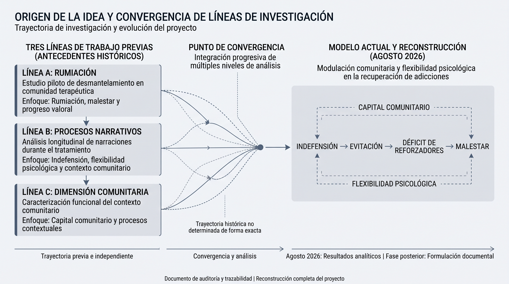
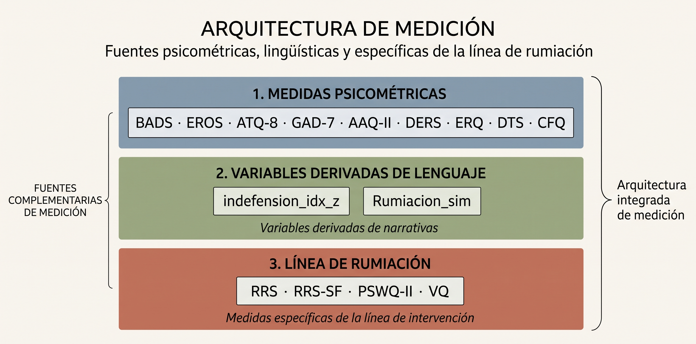
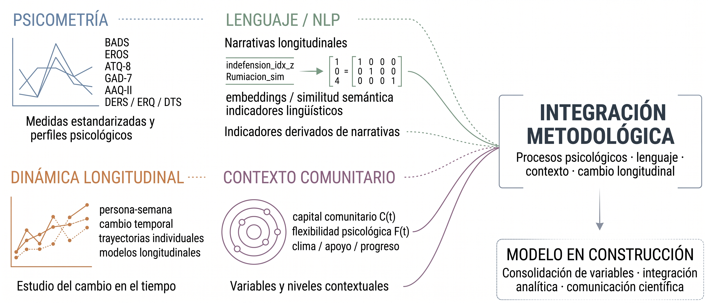

# RECONSTRUCCIÓN COMPLETA DEL PROYECTO

  

**Documento central.** Reconstruye el proyecto «Modulación comunitaria y flexibilidad psicológica en la recuperación de adicciones: un estudio de mediación secuencial».

Cada apartado distingue entre información procedente de **fuentes documentales recuperadas** (N1–N4) y elementos de **reconstrucción analítica o documental** (N5).

**Revisión 2 — 21 de septiembre de 2026.** Esta revisión incorpora la localización y verificación de resultados primarios previamente no identificados. La interpretación de la primera revisión, según la cual determinados coeficientes no habían sido localizados, queda rectificada a partir de la nueva evidencia documental.

Este documento presenta una **reconstrucción documental y analítica del proyecto**. No constituye una publicación de datos individuales ni reproduce materiales clínicos, identificadores o información potencialmente identificable.

---

## 1. Origen de la idea

El proyecto **no surgió inicialmente como un estudio independiente**. Su formulación actual emerge de la convergencia de tres líneas de trabajo desarrolladas previamente y de un bloque posterior de análisis centrado en los procesos comunitarios.

### Tres líneas que convergen

**Línea A — Rumiación.**
Un estudio piloto de desmantelamiento de rumiación en una comunidad terapéutica proporcionó el antecedente relacionado con rumiación, malestar y progreso valoral.

**Línea B — Procesos narrativos.**
El análisis longitudinal de narraciones producidas durante el tratamiento permitió explorar variables de proceso relacionadas con **indefensión, flexibilidad psicológica y contexto comunitario**.

**Línea C — Dimensión comunitaria.**
Una línea de trabajo centrada en la caracterización funcional del contexto comunitario aportó los elementos conceptuales y analíticos utilizados posteriormente para representar el **capital comunitario** y otros procesos contextuales.

### Punto de convergencia

Estas tres líneas confluyeron posteriormente en un modelo que relaciona **indefensión, evitación, disponibilidad de reforzadores y malestar**, incorporando además el posible papel modulador del **capital comunitario** y la **flexibilidad psicológica**.

La convergencia de estas líneas constituye el origen del proyecto en su formulación actual. Por ello, la reconstrucción debe entenderse como la recuperación de una trayectoria de investigación que fue integrando progresivamente distintos niveles de análisis, y no como la documentación de un estudio concebido desde el inicio como una única unidad metodológica.

### Cronología documental

Los materiales recuperados sitúan la generación de los principales resultados analíticos en **agosto de 2026**, mientras que la formulación documental del proyecto fue desarrollándose posteriormente. La secuencia exacta entre algunos materiales históricos y sus respectivas salidas analíticas permanece **no determinada**.

  

## 2. Pregunta inicial

La formulación inicial del proyecto se orienta a examinar **cómo el contexto comunitario y la flexibilidad psicológica se relacionan con los procesos psicológicos implicados en la recuperación**, particularmente aquellos vinculados con **rumiación, indefensión, evitación, disponibilidad de reforzadores y malestar**.

### Pregunta de investigación

> **¿Cómo se relacionan el contexto comunitario y la flexibilidad psicológica con la secuencia de procesos que vincula indefensión, evitación, disponibilidad de reforzadores y malestar en población residencial con trastornos por uso de sustancias?**

### Objetivo general

**Evaluar un modelo de mediación secuencial** que articula:

**indefensión → evitación → déficit de reforzadores → malestar**

e incorporar el posible papel modulador de:

* **capital comunitario**
* **flexibilidad psicológica**

en población residencial con trastornos por uso de sustancias.

### Estado de construcción

La pregunta y el modelo corresponden a la **formulación operativa actualmente en construcción** del proyecto. La especificación de constructos, relaciones analíticas, hipótesis y delimitación metodológica se encuentra en proceso de integración a partir de las distintas líneas de investigación que convergen en el proyecto.

## 3. Hipótesis

La formulación actual integra hipótesis provenientes de las distintas líneas de investigación que convergen en el proyecto. Su estado se presenta diferenciando entre **evidencia empírica disponible**, **resultados derivados de análisis previos** y **componentes actualmente en integración**.

| #      | Hipótesis                                                                                                                                                                | Evidencia disponible                                                  | Estado                                                                                                                                                                            |
| ------ | ------------------------------------------------------------------------------------------------------------------------------------------------------------------------ | --------------------------------------------------------------------- | --------------------------------------------------------------------------------------------------------------------------------------------------------------------------------- |
| **H1** | La indefensión se relaciona con la evitación, que a su vez se relaciona con un menor acceso a reforzadores y con mayor malestar, configurando una secuencia de procesos. | `mediacion_dos_pasos_bootstrap.txt` + resumen del proyecto            | **Respaldada por análisis previos**. Efecto indirecto: `indirect1 = 2.735`, `p < .001`.                                                                                           |
| **H2** | El capital comunitario puede modular la relación entre evitación y disponibilidad de reforzadores.                                                                       | `moderacion_capital_proxy_C.txt` + resumen del proyecto               | **Evidencia dependiente de la operacionalización**. El proxy C mostró `evit_cap = 0.195`, `p = .026`; el indicador compuesto `dico_capital_compuesto` mostró `0.045`, `p = .154`. |
| **H3** | La flexibilidad psicológica se relaciona con una menor presencia de déficit de reforzadores.                                                                             | `moderacion_flexibilidad_proxy_F.txt` + resumen del proyecto          | **Respaldada por evidencia previa**. `flex_c = −3.559`, `p = .022`, correspondiente a un efecto principal y no a una interacción.                                                 |
| **H4** | El protocolo breve de desmantelamiento de rumiación se asocia con mejoras en depresión y progreso valoral, con variación según la carga inicial de ATQ-8.                | `Resultados analisis estadistico.tex` + resultados del estudio piloto | **Respaldada en la línea experimental previa** y reproducida en los análisis disponibles.                                                                                         |

### Integración de las hipótesis

En conjunto, estas hipótesis constituyen el puente entre las líneas de investigación que dieron origen al proyecto y su formulación actual. **H1–H3** articulan el modelo de procesos psicológicos y contextuales, mientras que **H4** aporta evidencia procedente de la línea de intervención sobre rumiación.

La integración actual busca evaluar cómo estos componentes pueden representarse dentro de un **modelo multinivel**, distinguiendo los procesos individuales de los procesos contextuales y evitando asumir que los resultados obtenidos en líneas previas equivalen automáticamente a una prueba del modelo integrado.

### Estado de construcción

La matriz de hipótesis se encuentra en **proceso de integración y refinamiento**. Las relaciones ya respaldadas por análisis previos se conservan como antecedentes empíricos, mientras que su incorporación al modelo general requiere especificar progresivamente la operacionalización definitiva, las relaciones entre constructos y el esquema analítico correspondiente.

## 4. Muestra

El proyecto integra información procedente de diferentes niveles de análisis y de distintas líneas de investigación. Por ello, las cifras se presentan de acuerdo con la **unidad analítica correspondiente**, evitando equiparar participantes, observaciones longitudinales y subconjuntos específicos.

| Fuente / análisis                        |             N | Unidad de análisis | Descripción                                                   |
| ---------------------------------------- | ------------: | ------------------ | ------------------------------------------------------------- |
| **Modelo longitudinal principal**        |       **425** | Persona-semana     | 39 participantes con observaciones longitudinales             |
| **Base analítica exportada**             | **425 filas** | Persona-semana     | 39 identificadores únicos                                     |
| **Análisis GAM**                         | **425 / 400** | Persona-semana     | Estructura longitudinal con efecto aleatorio por participante |
| **Base de narrativas resumidas**         |        **33** | Participantes      | Participantes con información narrativa disponible            |
| **Subconjunto de análisis de rumiación** |        **21** | Participantes      | Subconjunto utilizado en la línea específica de rumiación     |
| **Subgrupo de comparación EROS**         |        **23** | Participantes      | Subgrupo utilizado para análisis comparativos                 |
| **Estudio piloto de rumiación**          |        **24** | Participantes      | 14 participantes en tratamiento y 10 en comparación           |

### Estructura de los datos

La unidad principal del análisis longitudinal es la **observación persona-semana**. En consecuencia, las **425 observaciones** corresponden a registros longitudinales derivados de **39 participantes**, y no a 425 participantes independientes.

Las diferentes cifras de `N` corresponden a **subconjuntos, fuentes de datos y niveles analíticos distintos**. Esta estructura permite integrar información longitudinal, narrativa y de intervención sin asumir que todas las fuentes representan la misma población analítica.

### Estado de construcción de la muestra

La caracterización de la muestra y la correspondencia entre las distintas fuentes se encuentran en **proceso de consolidación documental**. La versión definitiva del esquema muestral se establecerá conforme avance la integración de las bases, los análisis longitudinales y las líneas de investigación que convergen en el proyecto.

## 5. Instrumentos

El proyecto integra instrumentos psicométricos y variables derivadas de lenguaje provenientes de distintas líneas de análisis. Para preservar la trazabilidad metodológica, se distinguen las medidas que participan directamente en el **modelo principal**, aquellas utilizadas como **variables de control o en análisis paralelos**, y las correspondientes a la **línea específica de rumiación**.

### Medidas del modelo principal

| Instrumento / variable | Ítems | Función analítica                                                                                     | Fuente                                                              |
| ---------------------- | ----: | ----------------------------------------------------------------------------------------------------- | ------------------------------------------------------------------- |
| **BADS**               |    25 | Evitación y activación conductual; componente del modelo de procesos                                  | `Registro Quincenal…xlsx`; `variables_embeddings.csv`               |
| **EROS**               |    10 | Disponibilidad de reforzadores ambientales; variable de proceso y desenlace en análisis de moderación | `variables_embeddings.csv`; `esquema_bd_desmantelamiento_rumia.sql` |
| **ATQ-8**              |     8 | Resultado final del modelo de procesos y medida asociada a pensamientos automáticos negativos         | `variables_embeddings.csv`                                          |
| **GAD-7**              |     7 | Indicador de malestar psicológico y variable de contraste/control                                     | `variables_embeddings.csv`                                          |

### Variables complementarias

| Instrumento | Función                                           |
| ----------- | ------------------------------------------------- |
| **DERS**    | Regulación emocional                              |
| **ERQ**     | Estrategias de regulación emocional               |
| **DTS**     | Tolerancia al malestar                            |
| **AAQ-II**  | Flexibilidad psicológica / evitación experiencial |
| **CFQ**     | Fusión cognitiva                                  |
| **GHQ-12**  | Malestar psicológico general                      |
| **DASS-21** | Indicadores de sintomatología afectiva            |

Estas medidas se incorporan como **covariables, variables de contraste o componentes de modelos paralelos**, según el análisis específico.

### Línea de rumiación

La línea de investigación sobre rumiación utiliza medidas específicas para evaluar cambios pre-post y procesos relacionados:

| Instrumento | Función                                   |
| ----------- | ----------------------------------------- |
| **RRS**     | Rumiación                                 |
| **RRS-SF**  | Rumiación, versión breve                  |
| **PSWQ-II** | Preocupación                              |
| **VQ**      | Progreso y obstrucción respecto a valores |

Estas medidas corresponden a la línea de intervención y **no deben interpretarse automáticamente como variables del modelo longitudinal principal**.

### Variables derivadas de lenguaje

Dos constructos relevantes del proyecto se operacionalizan mediante variables derivadas de análisis semántico y no mediante un instrumento psicométrico convencional:

| Variable                              | Operacionalización                                     | Función                                          |
| ------------------------------------- | ------------------------------------------------------ | ------------------------------------------------ |
| **Indefensión** (`indefension_idx_z`) | Índice derivado de lenguaje y similitud con prototipos | Indicador de proceso relacionado con indefensión |
| **Rumiación** (`Rumiacion_sim`)       | Similitud semántica con prototipos de rumiación        | Indicador longitudinal de lenguaje rumiativo     |

Por tanto, **`indefension_idx_z` y `Rumiacion_sim` no representan puntuaciones directas de una escala psicométrica**. Constituyen variables derivadas utilizadas para operacionalizar procesos a partir de narrativas longitudinales.

### Arquitectura de medición

De manera esquemática, la arquitectura actual puede representarse como:

  

Esta organización permite mantener separadas las **medidas directamente integradas al modelo**, las **variables complementarias** y las **operacionalizaciones derivadas de lenguaje**, facilitando la trazabilidad entre bases de datos, análisis y resultados.

### Estado de construcción

La arquitectura de medición se encuentra en **proceso de consolidación metodológica**. Las definiciones de variables, su correspondencia con los instrumentos y su incorporación a los modelos analíticos se integran progresivamente conforme se consolidan las diferentes líneas de investigación que forman parte del proyecto.

## 6. Variables

La matriz completa de variables y su procedencia se encuentra en:

`../05_VARIABLES_Y_PROCEDENCIA/MATRIZ_PROCEDENCIA.md`

La matriz documenta la procedencia de las variables utilizadas en los análisis y permite establecer la correspondencia entre bases de datos, transformaciones, indicadores derivados y modelos analíticos. La documentación metodológica continúa ampliándose para precisar algunos aspectos secundarios de construcción y parametrización de determinados indicadores.

## 7. Construcción de los proxies

Los proxies de **capital comunitario (C)** y **flexibilidad psicológica (F)** son índices compuestos construidos a partir de variables disponibles en las bases longitudinales. Ambos se incorporan al modelo mediante sus versiones suavizadas temporalmente.

### 7.1 Capital comunitario (C)

El índice de capital comunitario se construye a partir de **13 variables normalizadas**:

`apoyo_social_norm`, `ct_norm`, `valencia_norm`, `esperanza_norm`, `progreso_norm`, `eros_norm`, `evitacion_inv_norm`, `gad7_inv_norm`, `ect_norm`, `iaa_norm`, `sueño_norm`, `adherencia_norm` y `estres_inv_norm`.

El procedimiento comprende:

1. Imputación por mediana de los valores faltantes.
2. Filtrado de variables con base en su varianza.
3. Estandarización y análisis de componentes principales mediante `prcomp(scale.=TRUE, center=TRUE)`.
4. Cuando los dos primeros componentes explican conjuntamente más del 70 % de la varianza, se utiliza una combinación ponderada de CP1 y CP2; de lo contrario, se utiliza CP1.
5. Transformación mediante `robust_plogis`.
6. Suavizado exponencial recursivo por participante, con **α = 0.3**.

El resultado utilizado en los análisis longitudinales es `C_smooth`.

### 7.2 Flexibilidad psicológica (F)

El índice de flexibilidad psicológica se construye mediante una combinación ponderada de tres componentes:

`F_flex = 0.45·F_proceso + 0.35·F_activacion − 0.20·F_evitar`

Los componentes se definen de la siguiente manera:

**F_proceso**

`coherencia + (1−Evitacion_sim) + (1−Fusion_sim) + insight + (1−lenguaje_rígido) + TTR`

**F_activacion**

`BADS_activación + Logro_sim + agencia + tolerancia + (1−hostilidad_rígida)`

**F_evitar**

`escape + rumiación + Evitacion_sim + Fusion_sim`

Posteriormente, el índice se transforma mediante `robust_plogis` y se aplica el mismo procedimiento de suavizado exponencial recursivo por participante, con **α = 0.3**.

El resultado utilizado en los análisis longitudinales es `F_flex_smooth`.

### 7.3 Consideraciones metodológicas

Los índices `C_smooth` y `F_flex_smooth` deben interpretarse como **proxies analíticos construidos para este proyecto**, y no como escalas psicométricas validadas.

El procedimiento de construcción es diferente para cada proxy: **C incorpora reducción dimensional mediante PCA**, mientras que **F utiliza una combinación ponderada de componentes definidos a partir de indicadores de proceso**. En ambos casos, el suavizado temporal constituye una etapa posterior de procesamiento de la señal longitudinal.

La documentación de los parámetros de construcción, pesos y transformaciones se mantiene vinculada al código fuente correspondiente para preservar la trazabilidad del procedimiento.

## 8. Análisis

Los análisis documentados corresponden a diferentes componentes del proyecto y se organizan de acuerdo con su función dentro de la arquitectura analítica. El bloque principal corresponde al modelo longitudinal de procesos; adicionalmente, se incluyen análisis complementarios y resultados procedentes de la línea independiente de intervención sobre rumiación.

### 8.1 Mediación secuencial

La mediación secuencial se estimó mediante `lavaan::sem`, con `cluster = "ID"`, estimador `MLR`, manejo de datos faltantes mediante `missing = "listwise"` y estimación de errores mediante bootstrap (`se = "boot"`, `bootstrap = 500`, `set.seed(2025)`).

El modelo evalúa la secuencia:

**indefensión → evitación → EROS → ATQ-8**

e incorpora como covariables el tiempo, el capital comunitario y el balance comunitario.

### 8.2 Moderación

Se estimaron tres modelos mediante `sem`, incorporando términos de interacción para evaluar el papel del capital comunitario, la flexibilidad psicológica y su combinación.

También se estimaron efectos indirectos condicionales en diferentes niveles del moderador, incluyendo valores de **±1 desviación estándar**.

### 8.3 Análisis complementarios

El mismo bloque analítico incluye:

* **GAM**, con términos suaves (`s(VAR, k=4)`) y efecto aleatorio por participante.
* **LMM**, mediante `lmer`, para examinar la relación de EROS, indefensión y rumiación con ATQ-8.
* **Random Forest (RF)** y **LASSO** para explorar predictores de múltiples desenlaces.
* **Rejillas de mediación**, con `n_boot = 500`.
* **Análisis correlacionales** entre variables del modelo.

Estos análisis tienen una función complementaria y exploratoria respecto al modelo principal y no se interpretan como pruebas equivalentes entre sí.

### 8.4 Línea independiente de intervención sobre rumiación

La línea de intervención sobre rumiación comprende un conjunto independiente de análisis psicométricos y longitudinales, entre ellos:

* cambio pre-post con intervalos de confianza bootstrap;
* ANCOVA;
* Reliable Change Index (RCI);
* análisis bayesianos;
* modelos lineales mixtos de crecimiento;
* análisis de abandono;
* clustering;
* análisis de componentes principales.

Los análisis correspondientes se encuentran documentados en:

`Rumia_adicciones/Analisis en R/Rumia_Adicciones.R`

y

`Rumia_adicciones/Rumia_Adicciones.R`

Esta línea constituye un antecedente empírico relacionado con los procesos de rumiación, pero sus resultados no se consideran automáticamente resultados del modelo longitudinal principal.

## 9. Resultados

### 9.1 Resultados del modelo longitudinal

Los resultados principales del bloque de mediación y moderación se encuentran localizados en sus salidas analíticas correspondientes.

#### Mediación secuencial

Archivo: `mediacion_dos_pasos_bootstrap.txt`

| Relación                | Estimación |       IC / significancia |
| ----------------------- | ---------: | -----------------------: |
| Indefensión → evitación |     10.013 |          [7.080, 12.947] |
| Evitación → EROS        |      0.730 |           [0.666, 0.794] |
| EROS → ATQ-8            |      0.374 |           [0.269, 0.480] |
| Efecto indirecto        |      2.735 | p < .001; [1.633, 3.837] |
| Efecto total            |      2.303 | p < .001; [1.366, 3.241] |

El efecto indirecto estimado para la secuencia completa fue **2.735**, con un intervalo bootstrap de **[1.633, 3.837]**.

#### Moderación por capital comunitario

Archivo: `moderacion_capital_proxy_C.txt`

La asociación entre evitación y EROS, bajo la operacionalización utilizada para el proxy de capital comunitario, presentó una estimación de **0.195** (p = .026; IC [0.024, 0.366]).

Los efectos indirectos condicionales fueron estimados en diferentes niveles del moderador:

**1.711 → 2.804 → 4.150**

correspondientes a niveles bajo, medio y alto de capital comunitario.

#### Flexibilidad psicológica

Archivo: `moderacion_flexibilidad_proxy_F.txt`

El efecto de la flexibilidad psicológica sobre EROS presentó una estimación de **−3.559** (p = .022; IC [−6.604, −0.515]).

En contraste, la interacción entre evitación y flexibilidad psicológica no fue significativa:

`evit_flex = 0.001`, p = .987.

Por tanto, en esta especificación, el resultado localizado corresponde a un **efecto principal de la flexibilidad**, no a evidencia de una interacción significativa sobre la relación evitación–EROS.

### 9.2 Resultados relacionados del bloque longitudinal

Los análisis complementarios mostraron los siguientes resultados:

* En el LMM `ATQ8 ~ EROS + indefensión + rumiación`, EROS presentó β = **0.366**, t = **21.0**.
* El efecto de indefensión fue β = **−0.060**, p = **.83**.
* El efecto de rumiación fue β = **6.14**, p = **.12**.
* La interacción `indef_z × EROS_z` presentó β = **−1.204**, p < **.0001**.
* La mediación `Indefensión → EROS → ATQ-8` presentó un efecto indirecto de **2.476**, p < **.001**.
* La mediación vía rumiación presentó un efecto indirecto de **−0.011**, p = **.760**.
* Los términos suaves de los GAM para capital comunitario y flexibilidad psicológica no fueron significativos (p = **.197** y p = **.533**, respectivamente).

Estos resultados complementan la caracterización del modelo, pero corresponden a especificaciones analíticas distintas y deben interpretarse de acuerdo con el modelo concreto en el que fueron estimados.

### 9.3 Resultados de la línea de intervención sobre rumiación

La línea independiente de intervención mostró cambios en diferentes medidas de resultado. Entre los efectos documentados se encuentran:

| Medida            |                 Efecto |
| ----------------- | ---------------------: |
| VQ Progreso       | g = +1.60; BF₁₀ > 1000 |
| DASS-21 Depresión | g = −0.86; BF₁₀ = 16.5 |
| GHQ-12            |              g = −0.81 |
| CFQ               |              g = −0.50 |
| AAQ-II            |              g = −0.75 |

Los cambios en rumiación y preocupación fueron de menor magnitud en comparación con estos indicadores.

Además, se documentaron cuatro efectos de moderación con estimaciones:

**β = +1.283, +1.757, −1.615 y −2.018**

Estos análisis fueron reproducidos y se encuentran documentados en:

`../09_RESULTADOS_REPRODUCIDOS/`

Los resultados de esta línea se presentan como **evidencia procedente del estudio piloto de intervención sobre rumiación** y se mantienen diferenciados de los resultados del modelo longitudinal principal.

## 10. Interpretación

### 10.1 Modelo longitudinal

Los resultados del modelo longitudinal son compatibles con una secuencia de asociaciones entre **indefensión, evitación, disponibilidad de reforzadores y ATQ-8**. Las asociaciones estimadas son positivas a lo largo de los primeros componentes de la cadena y el vínculo entre EROS y ATQ-8 presenta un coeficiente de **β = 0.374**.

En la especificación utilizada para el proxy de capital comunitario, los efectos indirectos condicionales aumentaron de **1.711 a 4.150** entre los niveles bajo y alto del moderador. Este patrón es consistente con una posible asociación entre el contexto comunitario y la magnitud del proceso indirecto estimado.

Para la flexibilidad psicológica, el análisis mostró un efecto principal negativo sobre EROS (**β = −3.559**). Sin embargo, la interacción entre flexibilidad y evitación no fue significativa (**p = .987**). Por tanto, el resultado localizado respalda una asociación directa en esta especificación, pero **no establece un efecto moderador sobre la relación evitación–EROS**.

Estos resultados deben interpretarse considerando que los proxies de capital comunitario y flexibilidad son **índices construidos para este proyecto y no escalas psicométricas validadas**, y que la unidad longitudinal de análisis corresponde a observaciones persona-semana.

### 10.2 Línea de intervención sobre rumiación

La línea independiente de intervención contextual-conductual mostró cambios en progreso valoral, malestar general y depresión, junto con modificaciones en otras variables psicológicas.

Los análisis de esta línea incluyen además efectos de moderación y otros modelos longitudinales. Estos resultados constituyen evidencia específica de la línea de intervención y **no deben interpretarse como una prueba directa del modelo longitudinal principal**.

La relación entre ambas líneas forma parte de la integración conceptual actual del proyecto, particularmente en torno a los procesos de rumiación, flexibilidad psicológica y cambio contextual.

## 11. Presentación y difusión prevista

El proyecto se encuentra en proceso de **preparación para su comunicación científica**. La documentación existente permite reconstruir los análisis y sus resultados, mientras que los materiales gráficos y de presentación se encuentran actualmente en elaboración.

Entre los antecedentes documentales de difusión se encuentran:

| Evidencia / material                        | Contenido                                                                                                        | Estado             |
| ------------------------------------------- | ---------------------------------------------------------------------------------------------------------------- | ------------------ |
| `SCIENTIFIC_DISSEMINATION_RECORD.md`        | Registro de una propuesta asociada con “Modulación comunitaria / PF (Candidato B)” para actividades de ACBS 2026 | En documentación   |
| `Captura de pantalla 2026-08-12 123002.png` | Registro de contexto de envío en plataforma de ACBS                                                              | Documentado        |
| `proyecto_ACBS_2026`                        | Reencuadre del proyecto como Candidato B dentro del programa ACBS 2026                                           | En desarrollo      |
| Póster científico del proyecto              | Síntesis visual del modelo, metodología y resultados                                                             | **En elaboración** |
| Presentación científica                     | Material para exposición del proyecto                                                                            | **Por elaborar**   |
| Publicaciones de líneas relacionadas        | `MFCA_springer.tex/.pdf`, manuscrito LLNCS, `Resultados preliminares marzo.pdf` y materiales CIAM                | Existentes         |

Los materiales de presentación específicos del proyecto se desarrollarán a partir de la arquitectura metodológica y los resultados documentados en este repositorio. Su contenido se mantendrá diferenciado de las líneas de investigación paralelas.

## 12. Evolución hacia DICO

La relación conceptual con **DICO** se documenta en:

`../12_RELACION_CON_DICO/TABLA_EVOLUCION_DICO.md`

La evolución conceptual puede resumirse como:

**Capital comunitario → `C(t)`**

**Flexibilidad psicológica → `F(t)`**

**Evitación / EROS → competencias `R_a` / `R_p`**

**Mediación lineal → acoplamiento dinámico no lineal**

En esta evolución, el modelo inicial de procesos psicológicos y comunitarios constituye un antecedente conceptual para una formulación dinámica posterior. El **IRC** desarrolla de manera específica la noción de rigidez dentro de este marco y cuenta con documentación metodológica independiente.

## 13. Aspectos en consolidación documental

La reconstrucción actual ha permitido recuperar los principales componentes analíticos, sus resultados y buena parte de la procedencia de las variables. Algunos elementos secundarios de documentación y trazabilidad permanecen en proceso de consolidación:

1. **Redacción histórica del proyecto:** la formulación documental original continúa en proceso de reconstrucción a partir de los análisis, scripts y materiales disponibles.
2. **Materiales de presentación:** el póster y la presentación científica específica del proyecto se encuentran en elaboración.
3. **Parámetros del PCA del proxy C:** se continúa documentando la varianza explicada y los criterios de selección de componentes.
4. **Construcción de `indefension_idx`:** se continúa consolidando la documentación del procedimiento de generación del indicador.
5. **Pesos del proxy F:** se continúa documentando la justificación metodológica de las ponderaciones utilizadas en su construcción.
6. **Correspondencia entre fuentes y tamaños muestrales:** la trazabilidad de algunos subconjuntos y cifras históricas continúa integrándose en la matriz de procedencia.

Estos puntos corresponden a **aspectos de documentación y consolidación metodológica**, no a la ausencia de los análisis: los resultados principales y sus salidas analíticas se encuentran identificados en las secciones correspondientes del repositorio.

## Cierre

La reconstrucción documental permite establecer una trazabilidad entre la formulación actual del proyecto, sus líneas de investigación precedentes, las bases analíticas, los procedimientos de construcción de variables y las salidas estadísticas recuperadas.

Los análisis y resultados documentados en este repositorio corresponden a las fuentes y especificaciones actualmente identificadas. La integración metodológica continúa en desarrollo, particularmente en la consolidación de la arquitectura de medición, la documentación de los índices compuestos y la preparación de los materiales de comunicación científica.

Las propuestas de mejora metodológica y los elementos pendientes de consolidación se mantienen documentados por separado en:

`../15_PENDIENTES_Y_HUECOS/PENDIENTES.md`

Esto permite distinguir entre **resultados y procedimientos recuperados**, **elementos actualmente en consolidación** y **propuestas metodológicas futuras**, preservando la trazabilidad del proyecto sin confundir análisis existentes con modificaciones posteriores.

  

